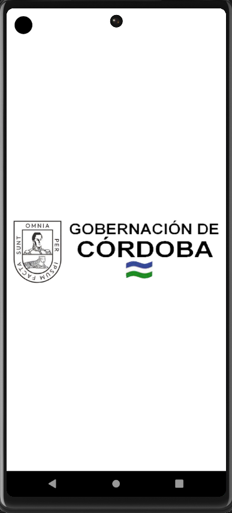

🚗 Impuesto Vehicular - Gobernación de Córdoba

  

📌 Descripción

La aplicación de Impuesto Vehicular de la Gobernación de Córdoba permite a los ciudadanos consultar y gestionar sus pagos de impuestos vehiculares de manera rápida y sencilla.

🚀 Características

✅ Consulta de impuestos vehiculares✅ Generación de recibos de pago✅ Notificaciones y recordatorios de vencimientos✅ Integración con pasarelas de pago✅ Diseño intuitivo y accesible✅ Soporte para Android, iOS y Web

📂 Estructura del Proyecto

Versión App Cordoba 2.0

root/
│-- android/          # Código nativo para Android
│-- ios/              # Código nativo para iOS
│-- assets/           # Imágenes y recursos estáticos
│-- lib/              # Código fuente de Flutter
│   ├── main.dart     # Archivo principal
│   ├── screens/      # Pantallas de la app
│   ├── widgets/      # Componentes reutilizables
│   ├── models/       # Modelos de datos
│   ├── api/          # Servicios de API y lógica de negocio
|   |── providers/    # Implementa el patrón Provider para la gestión del estado.
|   |── packages/     # Dependencias o utilidades empaquetadas dentro del proyecto.
│   |── ui/           #Contiene los elementos visuales y la arquitectura de la interfaz.
│-- pubspec.yaml      # Dependencias del proyecto
│-- README.md         # Documentación del proyecto

📲 Instalación y Configuración

1️⃣ Requisitos Previos

Flutter SDK 3.29.1

Dart SDK 3.7.0

Visual Studio Code

Dispositivo o emulador configurado

2️⃣ Clonar el Repositorio

git clone https://github.com/JoseLuisValencia28/app_cordoba.git
cd app_cordoba

3️⃣ Instalar Dependencias

flutter pub get

4️⃣ Ejecutar la Aplicación

📱 En Dispositivo o Emulador

flutter run

🌐 En Web

flutter run -d chrome

⚙️ Configuración Adicional

Si utilizas Firebase o APIs externas, asegúrate de configurar correctamente los archivos .env o google-services.json.

🛠️ Tecnologías Utilizadas

Flutter - Framework principal

Dart - Lenguaje de programación

Provider / Riverpod - Gestión de estado

REST API - Consumo de datos externos

📝 Licencia

Este proyecto está bajo la licencia MIT. Consulta el archivo LICENSE para más detalles.
